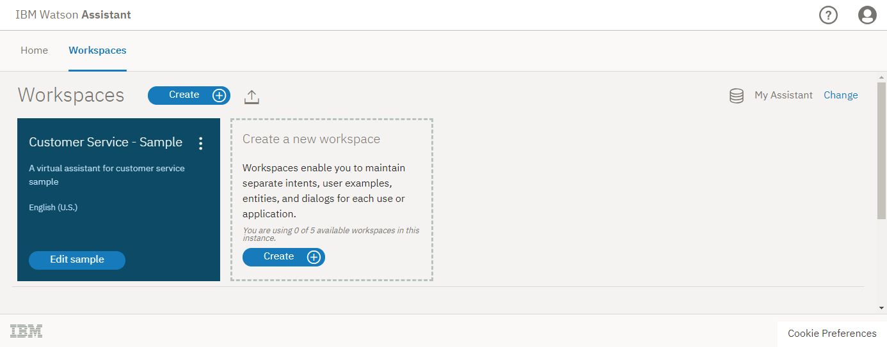
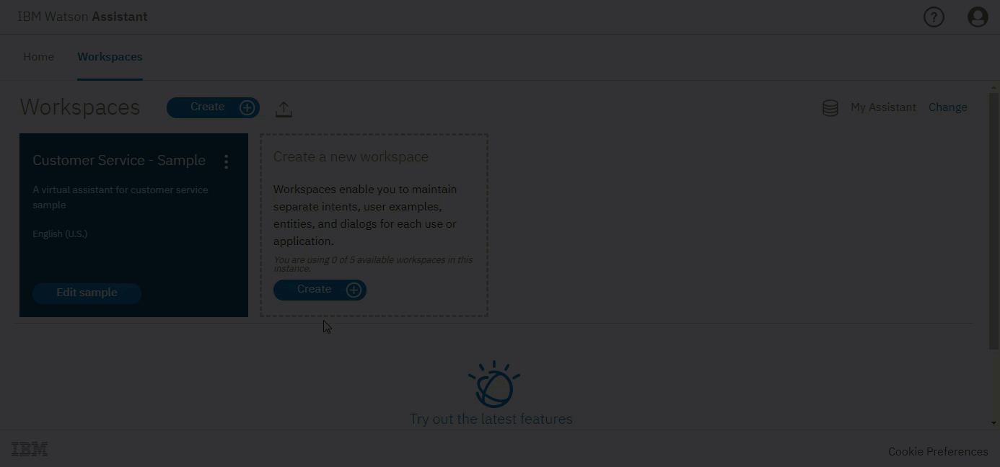
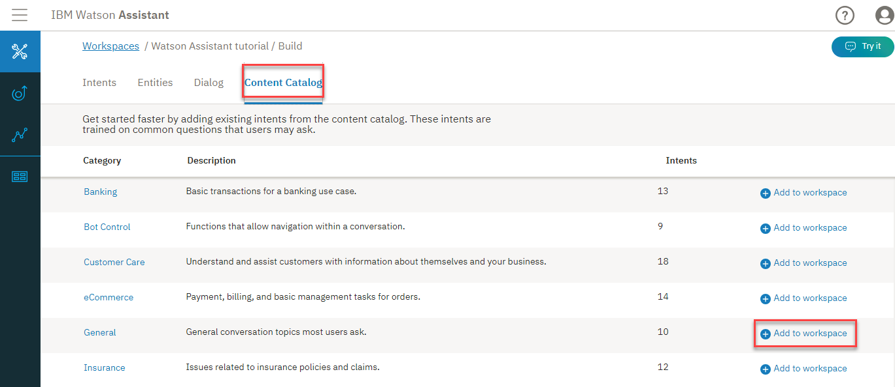
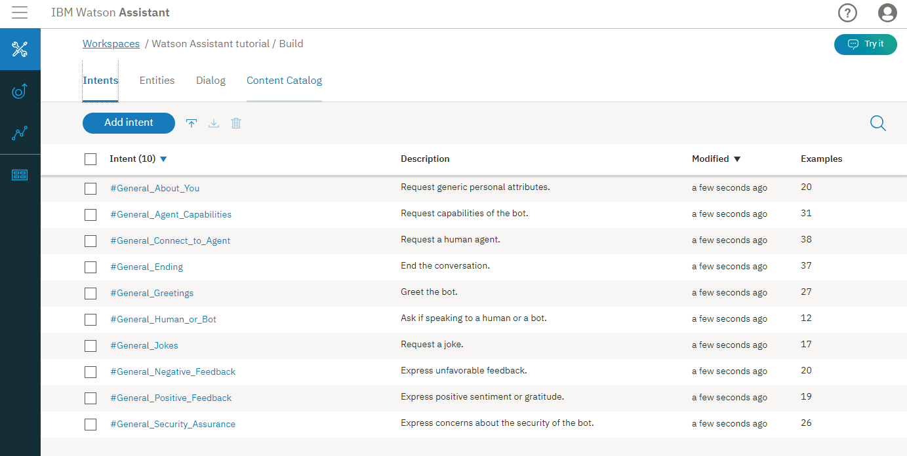
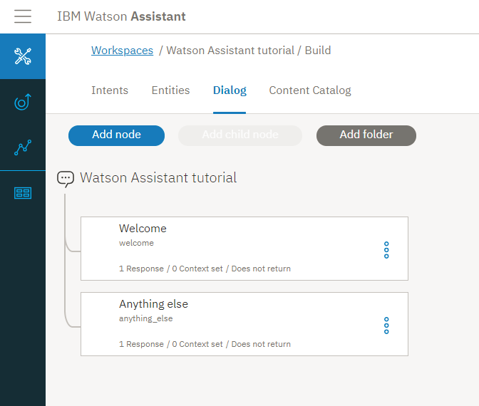
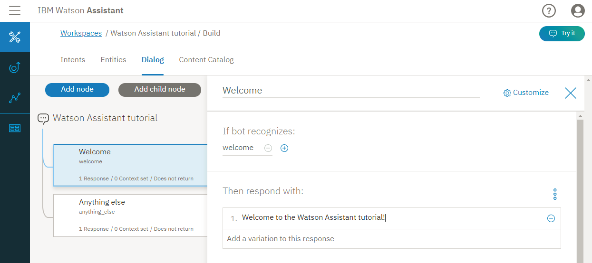
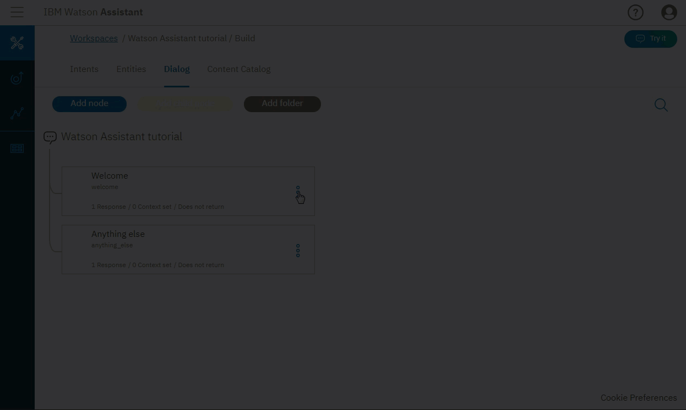
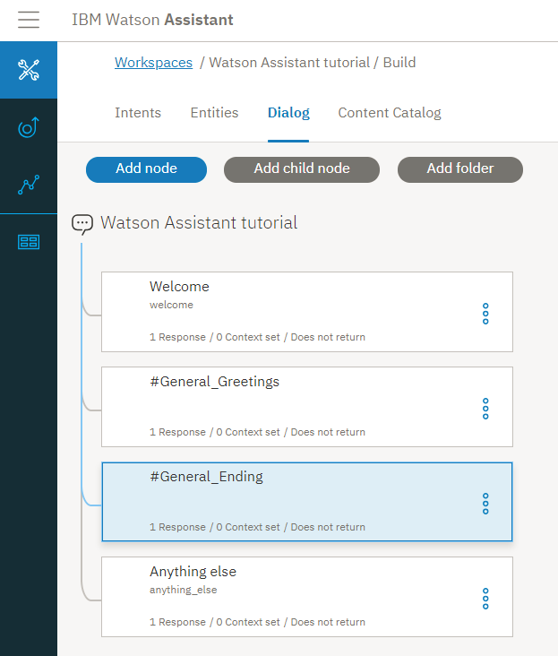
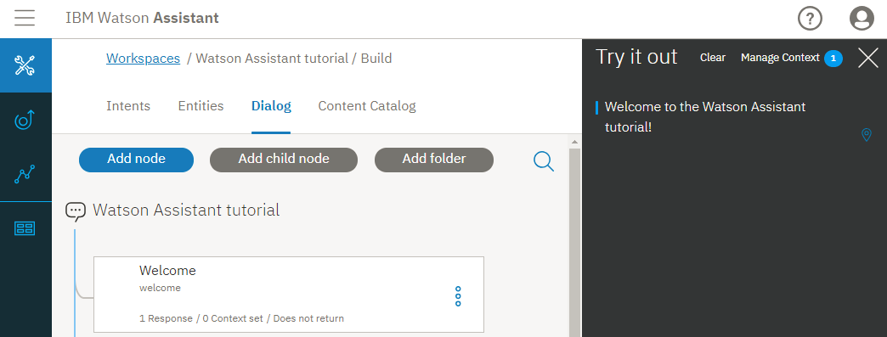
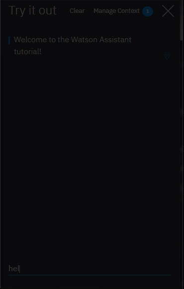

---

copyright:
  years: 2015, 2018
lastupdated: "2018-10-02"

---

{:shortdesc: .shortdesc}
{:new_window: target="_blank"}
{:tip: .tip}
{:deprecated: .deprecated}
{:pre: .pre}
{:codeblock: .codeblock}
{:screen: .screen}
{:javascript: .ph data-hd-programlang='javascript'}
{:java: .ph data-hd-programlang='java'}
{:python: .ph data-hd-programlang='python'}
{:swift: .ph data-hd-programlang='swift'}
{:download: .download}
{:gif: data-image-type='gif'}

# Getting started tutorial
{: #gettingstarted}

In this short tutorial, we introduce the {{site.data.keyword.conversationshort}} tool and go through the process of creating your first assistant.
{: shortdesc}

This version of the {{site.data.keyword.conversationshort}} documentation is deprecated. Go [here](https://console.bluemix.net/docs/services/assistant/getting-started.html) instead.
{: deprecated}

## Before you begin
{: #prerequisites}

You'll need a service instance to start.

<!-- Remove the text marked `download` after there's no g-s tab in the catalog dashboard -->

You created your service instance. Click **Manage**, then **Open tool**. Go to Step 2.
{: download tip}

If you created a {{site.data.keyword.conversationshort}} service instance, you're all set with these prerequisites. Go to [Step 1](#launch-tool).

1.  Go to the [{{site.data.keyword.conversationshort}} ](https://console.bluemix.net/catalog/services/conversation) page in the {{site.data.keyword.Bluemix_notm}} Catalog.
1.  Sign up for a free {{site.data.keyword.Bluemix_notm}} account or log in.
1.  Click **Create**.

## Step 1: Open the tool
{: #launch-tool}

After you create a {{site.data.keyword.conversationshort}} service instance, you'll land on the **Manage** page of the service dashboard.

On the **Manage** page, click **Launch tool**.

<!-- To do: Add screenshot for developer console -->

If you're prompted to log into the tool, provide your {{site.data.keyword.Bluemix_notm}} credentials.

If you're not at a project details page for the {{site.data.keyword.conversationshort}} service, go to the {{site.data.keyword.watson}} Developer Console [Projects ](https://console.bluemix.net/developer/watson/projects) page and select the project.
{: tip}

<!-- Remove this text after dedicated instances have the developer console: begin -->

{{site.data.keyword.Bluemix_dedicated_notm}}: Select your service instance from the Dashboard to launch the tooling.

<!-- Remove this text after dedicated instances have the Developer Console: end -->

## Step 2: Create a workspace
{: #create-workspace}

Your first step in the {{site.data.keyword.conversationshort}} tool is to create a workspace.

A [*workspace*](configure-workspace.html) is a container for the artifacts that define the conversation flow.

1.  From the home page of the {{site.data.keyword.conversationshort}} tool, click the **Workspaces** tab.
1.  Click **Create**.

    
1.  Give your workspace the name `{{site.data.keyword.conversationshort}} tutorial`. If the dialog you plan to build will use a language other than English, then choose the appropriate language from the list. Click **Create**. Youʼll land on the **Intents** tab of your new workspace.

{: gif}

## Step 3: Add intents from a content catalog
{: #add-catalog}

Add training data that was built by IBM to your workspace by adding intents from a content catalog. In particular, you will give your assistant access to the `General` content catalog so your dialog can greet users, and end conversations with them.

1.  In the {{site.data.keyword.conversationshort}} tool, click the **Content Catalog** tab.
1.  Find **General** in the list, and then click **Add to workspace**.

    
1.  Open the **Intents** tab to review the intents and associated example utterances that were added to your training data. You can recognize them because each intent name begins with the prefix `#General_`. You will add the `#General_Greetings` and `#General_Ending` intents to your dialog in the next step.

    

You have successfully started to build your training data by adding prebuilt content from IBM to your workspace.

## Step 4: Build a dialog
{: #build-dialog}

A [dialog](dialog-build.html) defines the flow of your conversation in the form of a logic tree. Each node of the tree has a condition that triggers it, based on user input.

We'll create a simple dialog that handles the `#General_Greetings` and `#General_Ending` intents, each with a single node.

1.  In the {{site.data.keyword.conversationshort}} tool, click the **Dialog** tab.

    
1.  Click **Create**.

    You'll see two nodes:
    - **Welcome**: Contains a greeting that is displayed to your users when they first engage with the bot.
    - **Anything else**: Contains phrases that are used to reply to users when their input is not recognized.

    
1.  Click the **Welcome** node to open it in the edit view.
1.  Replace the default response with the text, `Welcome to the {{site.data.keyword.conversationshort}} tutorial!`.

    
1.  Click  to close the edit view.

    Now let's add nodes to handle our intents between the `Welcome` node and the `Anything else` node.

1.  Click the More icon  on the **Welcome** node, and then select **Add node below**.
1.  Type `#General_Greetings` in the **Enter a condition** field of this node. Then select the **`#General_Greetings`** option.
1.  Add the response, `Good day to you!`
1.  Click  to close the edit view.

   {: gif}
1.  Click the More icon  on this node, and then select **Add node below** to create a peer node. In the peer node, specify `#General_Ending` as the condition, and `OK. See you later.` as the response.

1.  Click  to close the edit view.

   

## Step 5: Test the dialog

You built a simple dialog to recognize and respond to both hello and goodbye inputs. Let's see how well it works.

1.  Click the  icon to open the "Try it out" pane. The welcome message that you added is displayed.

   
1.  At the bottom of the pane, type `Hello` and press Enter. The output indicates that the `#General_Greetings` intent was recognized, and the appropriate response (`Good day to you.`) appears.
1.  Try the following input:
    - `bye`
    - `howdy`
    - `see ya`
    - `good morning`
    - `sayonara`

  {: gif}

{{site.data.keyword.watson}} can recognize your intents even when your input doesn't exactly match the examples you included. The dialog uses intents to identify the purpose of the user's input regardless of the precise wording used, and then responds in the way you specify.

## Step 6: Add a business function to the dialog
{: #add-ecommerce}

Add the *Customer Care* content catalog to your training data, so your dialog can address user requests for contact information.

1.  In the {{site.data.keyword.conversationshort}} tool, click the **Content Catalog** tab.
1.  Find **Customer Care** in the list, and then click **Add to workspace**.
1.  Open the **Intents** tab to review the intents and associated example utterances that were added to your training data. You can recognize them because each intent name begins with the prefix `#Customer_Care_`. You will add the `#Customer_Care_Contact_Us` intent to your dialog in a later step.

    
1.  Open the **Dialog** tab. Click the More icon  on the `#General_Greetings` node, and then select **Add node below** to create a peer node. In the peer node, specify `#Customer_Care_Contact_Us` as the condition.
1.  Add the following text as the response:

    ```
    Contact us by phone 24 hours a day, 7 days a week at 958-234-3456. To give us feedback, submit a feedback form through our <a href="https://www.example.com/feedback.html" target="_blank">website</a>.
    ```
    {: codeblock}

    
1.  Click  to close the edit view.

    
1.  Test the node you just added. Click the  icon to open the "Try it out" pane, and then enter `How can I contact you?`

    The `#Customer_Care_Contact_Us` intent is recognized, and the response that you specified for it to return is displayed.

    {: gif}

You have successfully added a node to the dialog that addresses the type of business-related question that real users might ask.

## Step 7: Review the sample workspace
{: #review-sample-workspace}

Open the sample workspace to see intents similar to the ones you just created plus many more, and see how they are used in a more complex dialog.

1.  Go back to the Workspaces page.
   You can click the  button from the navigation menu.
1.  On the **Customer Service - Sample** workspace tile, click the **Edit sample** button.

## Next steps
{: #next-steps}

This tutorial is built around a simple example. For a real application, you'll need to define some more interesting intents, some entities, and a more complex dialog.

- Try the advanced [tutorial](tutorial.html) to add entities and clarify a user's purpose.
- [Deploy](deploy.html) your workspace by connecting it to a front-end user interface, social media, or a messaging channel.
- Check out the [sample apps](sample-applications.html).
