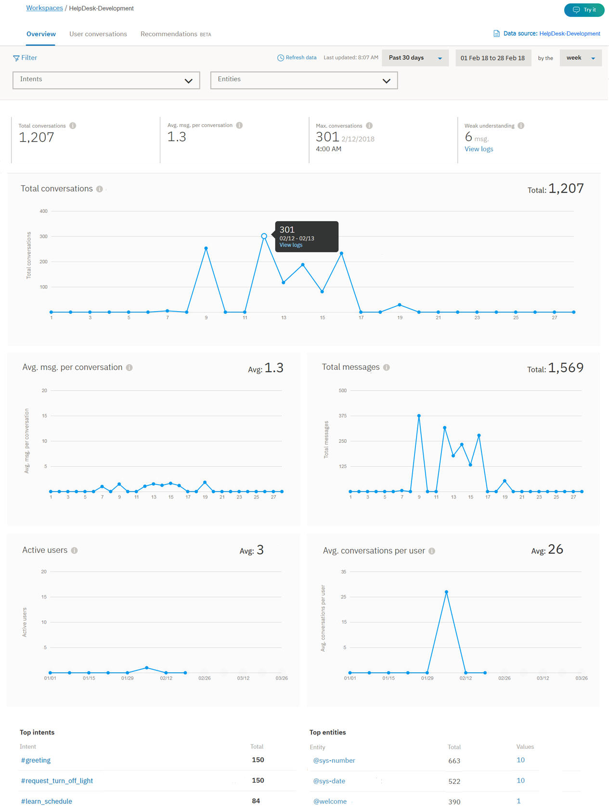
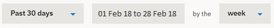
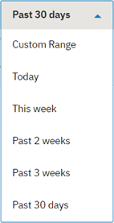
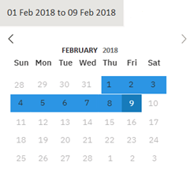
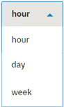
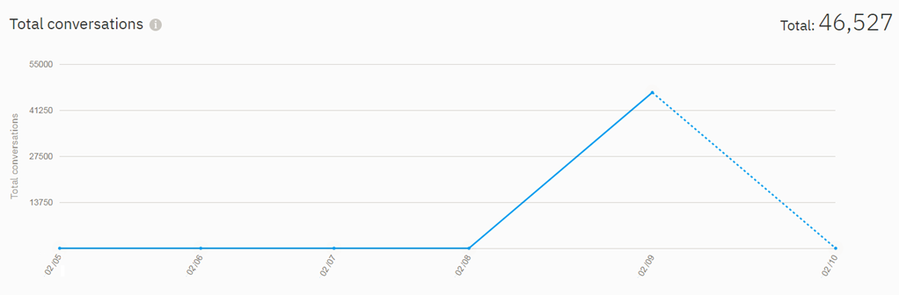

---

copyright:
  years: 2015, 2018
lastupdated: "2018-07-18"

---

{:shortdesc: .shortdesc}
{:new_window: target="_blank"}
{:tip: .tip}
{:pre: .pre}
{:codeblock: .codeblock}
{:screen: .screen}
{:javascript: .ph data-hd-programlang='javascript'}
{:java: .ph data-hd-programlang='java'}
{:python: .ph data-hd-programlang='python'}
{:swift: .ph data-hd-programlang='swift'}

# The Overview page

The Overview page provides a summary of interactions between users and your application/bot. You can view the amount of traffic for a given time period, as well as the intents and entities that were recognized most often in user conversations.
{: shortdesc}

The statistics that are displayed on the Overview page cover a longer period of time than the period for which logs of conversations are retained. These statistics represent external traffic - users or API calls - that has interacted with your application; they do not include interactions from the *Try it out* pane in the tool.

You can use the Overview page to answer questions like:

* Which days had the largest or smallest numbers of conversations in the last month?
* What was the average number of conversations per week during the last month?
* Which intents appeared most often last week?
* Which entity values were recognized the most times during February?

To open the Overview page, select **Overview** in the navigation bar.

  

## Controls
The top part of the page includes the following controls:

* *Intents* and *Entities* filters - Use either of these drop-down filters to show data for a specific intent or entity in the workspace.

  **Important** - The intent and entities filters are populated by the intents and entities in the ***workspace***, and not what is in the data source. If you have [selected a data source](logs.html#deploy_id) other than the workspace, you might not see an intent or entity from your data source logs as an option in the filters, unless those intents and entities are also in the workspace.

* *Refresh data* - Allows you to refresh the Overview page statistics immediately. The Overview page shows when the data that it displays was last updated. You can select **Refresh data** if you think that newer data might be available.

* Date filters - Use these filters to choose the period for which data is displayed. These filters affect all data shown on the page: not just the number of conversations displayed in the graph, but also the statistics displayed along with the graph, and the lists of top intents and entities.

  **NOTE**: Premium plan users can review 90 days of data; all other plan users can review 30 days of data.

  

  You can choose whether to view data for a single day; for one, two, or three weeks; or for 30 days. There is also a `Custom Range` option that lets you choose something else over the past thirty days, such as 10 days.
  
  

  You can use the date range selector to narrow a specific range, or to pick a specific day.

  

  Finally, you can narrow your selection by hour, day, or week, depending on what range you've chosen.

  

  In each case, the data points on the graph adjust to an appropriate measurement period. For example, when viewing a graph for a day, the data is presented in hourly values, but when viewing a graph for a week, the data is shown by day.

  **NOTE**: If you choose a single day view, for example, the time shown for each conversation is localized to reflect the time zone of your browser. This may differ from the timestamp shown if you review the same conversation log via an API call; API log calls are always shown in UTC.

    

   A week always runs from Monday through Sunday. This means that the selection "This week" shows data since the start of the previous Monday, which may not be a full week. Likewise, the selections "Past 2 weeks" and "Past 3 weeks", might show a partial current week plus one or two previous weeks. Use a custom range if you want to filter by different start and end dates for a week or month, such as a week that runs from Thursday to the following Wednesday, or a month that begins on any date other than the first. If the last interval of the selected date range is incomplete, the graph shows as a dotted line.

    

## Graphs and statistics
Several statistical scorecards provide log data for your application:

* *Total conversations* - The total number of conversations between active users and your application, during the selected time period, as shown in the corresponding graph.

  **Note**: A single conversation is a set of messages consisting of the messages that an active user sends to your application, and the messages your application responds with.

  **Important**: A 'conversation' is considered to be *any* set of messages sent or received by an application/bot, so if the service starts by saying "Hi, how can I help you?", and then the user closes their browser without responding, that message is included in the total conversation count.

* *Avg. msg. per conversation* - The total messages received during the selected time period divided by the total conversations during the selected time period, as shown in the corresponding graph.
* *Max. conversations* - The maximum number of conversations for a single data point within the selected time period.
* *Weak understanding* - The number of individual messages with weak understanding. These messages are not classified by an intent, and do not contain any known entities. These can be useful in identifying potential dialog problems.

Detailed graphs provide additional information:

* *Total conversations* - The total number of conversations between active users and your application, during the selected time period.

  While viewing the ***Conversations*** graph, you can click on an individual data point to see the numeric value, as shown here:

  

* *Avg. msg. per conversation* - The total messages received during the selected time period divided by the total conversations during the selected time period.
* *Total messages* - The total number of messages received from active users over the selected time period.
* *Active users* - The number of unique users who have engaged with your application within the selected time period.
* *Avg. conversations per user* - The total conversations during the selected time period divided by the total unique users during the selected time period.

  **Note**: Statistics for *Active users* and *Avg. conversations per user* require a unique `user_id` parameter. See [Enabling user metrics](logs.html#user_id) for more information.

## Top Intents and Top Entities

You can also view the intents and entities that were recognized most often during the specified time period.

* *Top intents* - Intents are shown in a simple list. In addition to seeing the number of times an intent was recognized, you can select an intent to open the [User conversations](logs_convo.html) page with the date range filtered to match the data you are viewing, and the intent filtered to match the selected intent.

* *Top entities* are also shown in a list. For each entity you can select from the **Values** column to see a list of the most common values that were identified for this entity during the time period. You can also select an entity to open the [User conversations](logs_convo.html) page with the date range filtered to match the data you are viewing, and the entity filtered to match the selected entity.
